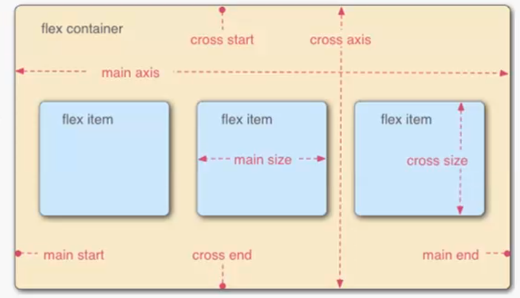

# HTML5-CSS3 Review
HTML5-CSS3 Review

#### IE兼容
``` 
<!--[if lt IE 9]>
    <script src="https://cdn.staticfile.org/html5shiv/r29/html5.min.js"></script>
	<script src="https://cdn.staticfile.org/respond.js/1.4.2/respond.min.js"></script>
<![endif]-->
```

## 新的网页结构
- `header`  头
- `nav` 导航
- `article` 与上下文无关的独立类容
- `section` 完整的文章
- `aside` 内容相关的辅助信息
- `footer` footer
  
## 新增的主体结构元素
- `article`  独立的内容
- `section`  用于分块 相对独立 不推荐没有标题的内容使用section
- `aside`    内容相关的辅助信息 应用OR小广告
- `nav`      导航
- `time`     `<time datetime="2019-1-19">2019-1-19</time>`
- `pubdate`  文件发布时间`<time datetime="2019-1-19" pubdate='pubdate'>2019-1-19</time>`
- `header`   具有引导和导航的区域 比如网站标题OR文章标题
- `dl`       用于表示数语
``` 
    <dl>
        <dt>定义术语</dt>
        <dd>解释术语</dd>
    </dl>
```
当容器要设置样式时,推荐使用`div`

## CANVAS
- 创建画布
``` 
<canvas id='canvas' width='500' height='500'></canvas>
```
- 引入绘画JS
- 使用draw语句绘画
>步骤
- 获取canvas元素
- 得到上下文
    - getContent()
- 填充与绘画边框
    - 填充 fill
    - 绘制边框 stroke
- 设置绘制样式
    - fillStyle填充样式
    - strokeStyle图形边框样式
- 指定画笔宽度
- 设置颜色值
- 绘画

>绘制矩形
``` 
<body onload="draw('canvas')">
    <canvas id="canvas" width="500" height="500">

    </canvas>

    <script>
        function draw(id) {
          let canvas = document.getElementById('canvas')
          let context = canvas.getContext('2d')
          context.fillStyle = "#000"   
          context.strokeStyle = "#f60"
          context.lineWidth = 5
          context.fillRect(0,0,400,300)   //x,y,w,h
          context.strokeRect(50,50,180,120) //x,y,w,h
          context.strokeStyle = "#fff"
          context.strokeRect(110,110,180,120)
        }
    </script>
</body>
```

#### canvas绘制动画 通过不断更改坐标 擦除 重绘
- 设置动画间隔 setInterval(code,millisec) 单位毫秒
- 用来绘图的函数 
   - 通过不断更待X和Y的坐标
   - 在该函数中先用clearRect方法将画布整体或者局部擦除
   
注释:这边我就不看了 继续HTML5吧  有空深入了解下CANVAS

## 本地储存
- sessionStorage 临时储存
- localStorage  永久储存
- loadStorage.length   获取数据条数
- loadStorage.clear()  清除
- loadStorage.key(index) 传入index 获取数据
``` 
  设置
    sessionStorage.setItem('key','value')
    or
    sessionStorage.key = 'value'
  获得
    let value = session.getItem('key')  
    or
    let value = session.key(index)
```

[小demo 简单的网页浏览版]('./Storage/Storage.html')
- new Date().getTime() 获取当前时间搓

# CSS3 部分

### 选择器部分

- `[att*=val]` 如果元素用att表示的属性值中包含val指定字符,就选择
- `[att^=val]` 如果用att表示的属性值的开头符号用val指定的字符的话
- `[att$=val]` 如果以这个结尾

#### 结构性伪类选择器
- a:link 未被访问连接
- a:visited 已被访问
- a:hover 鼠标放上去
- a:active 鼠标点击上去
- :first-line 用于某个元素第一行
- :first-letter 用于某个元素中的文字的首字母
- :before 在元素之前插入内容
- :after 在元素之后插入内容
- :root 绑定到页面的根元素中
- :not 排除子结构元素 body :not(h1){color:red}
- :empty 内容为空白选择
- :target 用户点餐超链接,并且跳转到target元素后起作用
- :first-child 第一个子元素
- :last-child 最后一个子元素
- :nth-last-child(n)匹配倒数第n个子元素
- :nth-child(n)匹配正数第n个元素
- :nth-child(odd)匹配奇数(even)匹配偶数
- :nth-of-type 匹配同一类型元素正数 :nth-last-of-type  倒数 (odd) 奇数 (even) 偶数

### 元素状态选择器
- :hover
- :active
- :focus 元素获得光标焦点时
- :enabled 元素处于可用状态
- :disabled 元素处于不可用状态
``` 
        input[type='text']:hover{
            background-color: #008a00;
        }
        input[type='text']:focus{
            background-color: #9933ff;
        }
        input[type='text']:active{
             background-color: #0066cc;
        }
```

#### 使用选择器插入内容
- after
- before
``` 
        h2:before{
            content: 'Tile';
            color: #fff;
            background-color: green;
            padding: 1px 15px;
            margin-right: 10px;
        }
        图片:
        content: url()
        计数器:
        content:counter(计算器名称)
        
```

### 文字阴影与自动换行
- text-shadow 增加阴影  :x y 模糊半径 color
- word-break 页面文字自动换行 
- word-wrap 让浏览器在长单词或很长的url地址中间进行换行
- font-face
``` 
    @font-face{
    font-family:webFont;
    src:url('font/字体名称.otf')fontmat('opentype')
    }
```

# 盒子模型
- display
    - inline-block 属于block盒的一种,BUT同时拥有inline的特点e
    - vertical-align 默认是底部对齐  vertical-align: top;
    - inline-table 盒类型 table 前后文字都同行显示
    - list-item 将多个元素作为list显示
    - non 当元素指定none时元素不会被显示
- 实现水平菜单

#### overflow
- 解决溢出问题
- overflow:hidden 超出容纳范围文字被隐藏
- scroll 滚动条
- auto auto智能一些
- visible  该咋咋地   
- overflow-x or overflow-y 超出x or y 执行
- text-overflow 可以在盒子的末尾显示 “。。。” 当盒中内容x方向超出才有效     
``` 
        div{
            white-space: nowrap;
            width: 300px;
            border: solid 1px darkgreen;
            overflow: hidden;
            text-overflow:ellipsis;
        }
```

#### 盒子阴影
- box-shadow  x y 模糊半径 color `box-shadow: 6px 6px 3px lightblue;`
- x y  设置为0时会在盒子周围绘制

#### box-sizing
>针对元素的宽度高度的计算方法
- content-box 元素的宽度与高度不包括补白区域及其边框高度
- border-box 元素高度包括补白区域及其边框高度
- 默认content-box

### 定位
- 普通流
- 浮动
- 绝对布局
- position  把元素放在静态的 相对的 绝对的 或者固定的位置中
    - static
    - relative 
    - absolute  脱离
    - fixed
- top left right bottom
- overflow 设置溢出区域发生的事件
- clip 设置显示形状
- vertical-align 设置元素垂直对齐方式
- z-index 设置元素层叠顺序
- float
    - left 
    - right
    - none 
    - inherit 从父类继承浮动
- clear 清除浮动    
    - left,right
    - both
    - inherit
    
#### CSS3 new 背景和边框的相关样式
- background-clip
- background-origin
- background-size
- background-size
- background-break
- background-image:url()
- background-repeat:no-repeat 背景不重复
- border-radius 绘制半径  顺时针
- border-image 

#### CSS3 动画
- transform 

这边我就不看了有空再来填坑

## 布局
- 多栏布局
    - column-count:栏目数 按栏目数分栏
    - column-width:指定栏目的宽度来生成分栏
    - column-gap: 指定栏目与栏目之间的距离
    - column-rule: 栏目与栏目之间增加一条分割线 `column-rule: solid 3px chartreuse;`
- 盒布局
    - box `display: -webkit-box;`
- 弹性盒布局
    - box-flex display:flex  `-webkit-box-flex: 1;`
    - box-ordinal-group 改变元素显示顺序 `-webkit-box-ordinal-group:1` 越小优先级越高
    - box-orient 改变多个元素排列方向 horizontal水平 vertical垂直
    - 元素自适应
    - box-flex 清除弹性盒模型的空白 `-webkit-box-flex: 1;`
    - 对多个元素使用box-flex 让浏览器总高度或者总宽度等于浏览器的
    - box-pack box-align 指定元素中的文字图像的对齐方式

### Flex布局
- 需要布局的父元素(flex container) 弹性容器
- 弹性子元素(flex item)
- 主轴main axis 侧轴cross axis

- flex-direction 主轴 :row水平从左到右|row-revers从右到左|column垂直重上到下|column-reverse垂直重下到上
- flex-wrap 溢出是否换行 :nowrap不换行|wrap换行|wrap-revers逆序换行
- flex-flow flex-direction和flex-wrap的复合属性 `:[flex-direction]||[flex-wrap]`
- justify-content x主轴上的对齐方式 :flex-start左对齐|flex-end右对齐|center居中|space-between第一个和最后一个到边缘 其余均匀分布|space-around全部均匀分布
- align-items y侧轴上的对齐方式 :flex-start顶对其|flex-end地对其|center|baseline基线对齐|stretch
- align-content 侧轴有空白时,侧轴上的对齐方式 :flex-start|flex-end|center|space-between|space-around|stretch

- order 控制弹性容器里子元素的顺序 数值小的排前
- flex-grow 设置弹性元素的扩展比率 
- flex-shrink 设置弹性子元素的收缩比率
- flex-basis 设置弹性子元素收缩前默认大小
- flex flex-grow,flex-shrink,flex-basis属性的复合属性
- align-self 允许独立的弹性子元素覆盖弹性容器的默认对齐设置 `[侧轴对齐方式]`auto|flex-start|flex-end|center|baseline|stretch


### 媒体查询
